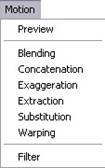
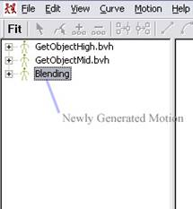

# Synethsis of MoCap Motion

Motion capture seems to be an ideal solution to bring realistic and natural motion into a digital form.  However,  motion captured data lacks flexibility and is very difficult to be edited without degrading its quality.  MotionEditing is a tool to make new motions from the existing MoCap motions.  It treats the motions as signals and processes it through different binary operations: Motion Blending, Motion Concatenation, Motion Exaggeration, Motion Extraction, Motion Substitution and Motion Warping.

"MotionEditing" was a tool working with the Multimedia Innovative Centre in The Hong Kong Polytechnic University.  It is for editing motions from MoCap system and supports six operations: Motion Blending, Motion Concatenation, Motion Exaggeration, Motion Extraction, Motion Substitution and Motion Warping.

## User Interface

1. Panel

There are two main views in the system: Selection View and Curve View.  The Selection View lets the user select a motion or a joint listed in the view.  The Curve View displays the curve(s) of a joint which is being selected in the Selection View.

*Figure 1.1*

   

2. Motion Import and Selection

To import a motion from MoCap file, click the File menu and then select Import item in Fig 1.2.  The import dialog will be popped out (Fig 1.3).

*Figure 1.2*

   

*Figure 1.3*

   

Select either a TRC file or BVH file to be imported or an imported motion will appear in the Selection View.  In this example, two BVH files are imported:

*Figure 1.4*

   

The user can select one of them by clicking a motion item over the Selection View.  Before really get into the process of motion editing, it is suggested that the all data points of the motion are fitted to the curves.  To do so, just simply select which motion to be fitted and then click Fit button in the toolbar.  During the fitting process, the status bar in the left bottom of the panel is showing the progress.

3. View Curve

It is very convenient to view and analyses the motion curve here by expanding the motion item (Fig 1.5).  You can view a set of curves of a joint by selecting a joint or merely view a single curve by selecting one of curves inside a joint node.  Each curve inside the same joint is presented with different colors.  For BVH file type, there are some joints called End Site.  It represents the ending joint of a skeleton.

To see the control points of the curve which was fitted, click View Menu and select Control Points, shown in Fig 1.6.  The control points are very dense because the system chosen the finest knot sequence in the curve fitting process.  For the interpolated curves, you can select Interpolated Points in View Menu and obtain it like in Fig 1.8.  The interpolated curve is a transparent one and the original data curve is a solid one.  This allows the user to browse whether the fitted curve is well fitted to scattered data curve.  The curve scale also can be magnified or diminished by clicking the magnifying glass buttons shown in the toolbar.  To return to the original scale, just press R buttons besides the magnifying glass buttons.

*Figure 1.5*

   

*Figure 1.6*

   

*Figure 1.7*

   

*Figure 1.8*

   

4. Motion Editing

There are totally six operations for motion editing in this version: Blending, Concatenation, Exaggeration, Extraction, Substitution and Warping.  All these are listed in the Motion Menu:

*Figure 1.9*

   

Please notice that, before applying these operations to your motion, the motion must already be fitted to the curves by clicking Fit button in the toolbar of Fig 1.4.  When the Blending item is selected, an editing dialog will show up (Fig 1.10).  List in the left side only shows the FITTED motion from the Selection View.  List in right shows motion(s) having been selected to be edited.  Only motions with identical skeleton can be selected together.  Once you successfully put two motions to the right side’s list, J button will be enabled and you can click it to get into the motion editing mode.

*Figure 1.10*

   

*Figure 1.11*

   

In the motion editing mode, the user can see the two motions going to be edited and choose which joints to be blended with independent similarity being set from the Similarity Slider Bar.  The total length of the edited clip is referring to the length of primary motion and it can be set by adjusting the Start Frame Slider and End Frame Slider below the Primary Motion View.  After selecting which joints to be blended, the similarity value of the joint can be set separately.  Finally, enter the name for this new motion and press OK button.  After some calculations, the new edited motion will appear on the Selection View, like in Fig 1.12.

For Motion Exaggeration, Concatenation and Substitution, they all are similar to Motion Blending.  They only have slightly difference in parameter adjustment.  In Fig 1.13, the user can adjust the degree of exaggeration by setting E Factor Slider Bar.  For Motion Concatenation, the transition time between two clips should be specified.  For Motion Substitution, it is simply necessary to select which joints in the primary clip to be replaced by the secondary clip.

*Figure 1.12*

   

*Figure 1.13*

   

*Figure 1.14*

   

For Motion Extraction, the parameters are start frame and end frame of the new clip, and finally the name for this.  Motion Warping allows the user to change the time scale of the clip.  If the duration value is smaller than the original time, the final clip will be a fast play.  Otherwise, it will become a slower motion play.

*Figure 1.15*

  
  
   

5. Motion Preview

To have a look on the edited or source motions, simply double click the motion item in the Selection View, or select the motion item first and then choose Preview in the Motion Menu.  In the Motion Preview Dialog, there is a Frame Slider Bar for viewing a specified frame.  If the Play button is pressed, it will play the frame as a animation sequence.  Simply the Stop and Pause buttons are to reset and hold the playing of the clip respectively.

*Figure 1.16*

   

If you want to change the camera direction, put drag the mouse cursor left and right over Motion Preview Dialog.  To zoom in and out, drag the mouse up and down with mid mouse button held.

6. Motion Export

Finally, you can export the edited motion to the BVH file for further use in some high-end modeling software.  To do so, first select the motion to be exported in the Selection View and then choose Export in the File Menu.  After specifying the file path and file name, click Save button.